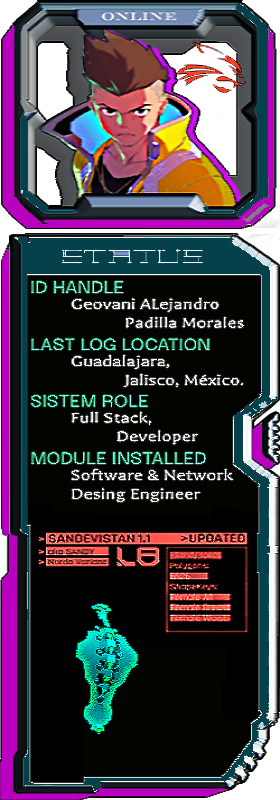
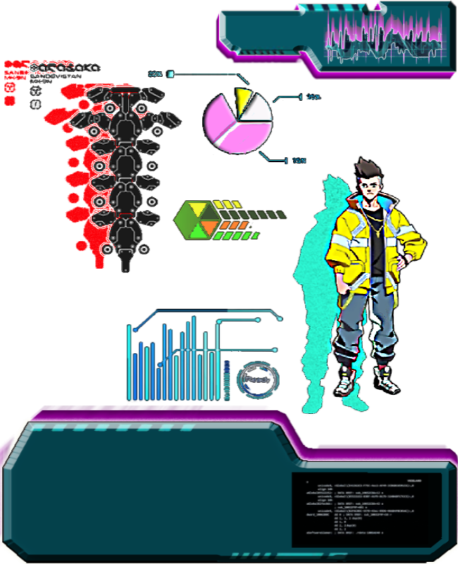

<div align="center">
  
<!-- Welcome Banner -->
# AlexDevPASolution & CiberPunk EdgeRunners Mod
  
</div>

> **⚠️ WARNING:**
> Welcome to the grid, Netrunner. You've successfully access. 

<!-- Home Header -->
<div align="center">
  <table width="100%">
    <tr>
      <td>
        
      </td>
    </tr>
  </table>
</div>
<div align="center">
  
  ```diff
  @@         SYSTEM BOOT SEQUENCE INITIATED          @@
          @@          NEURAL INTERFACE: ESTABLISHED           @@
    @@        CYBERDECK STATUS: OPERATIONAL            @@
  ```

[](https://git.io/typing-svg)

</div>
<details>
<!-- About me Section -->
<summary>🟢 SYSTEM BOOTING...</summary>

## System Status

```diff
+ CONNECTION_STATUS: ACTIVE
+ PING: 23ms
+ ENCRYPTION: ENABLED
```
  
<div align="center">
  <table width="100%">
    <tr>
<!-- Primera columna (izquierda) -->
      <td>
        
      </td>
<!-- Segunda columna (derecha) -->
      <td align="center">
        <div style="background: rgba(115, 71, 199, 0.42); border-radius: 15px;">
          
        </div>
      </td>
    </tr>
  </table>
</div>
</details>
<details>
<!-- Skills Section -->
<summary>🟢 EDGERUNNER LOADOUT...</summary>

##  Cyberware Modules (Skills)

<div style="background: blue;">
  <table>
    <tr>
      <td align="center"><br>Windows</td>
      <td align="center"><br>Apple</td>
      <td align="center"><br>Ubuntu</td>
      <td align="center"><br>Android</td>
      <td align="center"><br>AndroidStudio</td>
      <td align="center"><br>VSCode</td>
      <td align="center"><br>Git</td>
      <td align="center"><br>GitHub</td>
      <td align="center"><br>MySQL</td>
      <td align="center"><br>Powershell</td>
      <td align="center"><br>Bash</td>
    </tr>
    <tr>
      <td align="center"><br>Jira Software</td>
      <td align="center"><br>AutoDesk</td>
      <td align="center"><br>Markdown</td>
      <td align="center"><br>JavaScript</td>
      <td align="center"><br>Python</td>
      <td align="center"><br>React</td>
    </tr>
  </table> 
</div>
</details>
<details>
<!-- Projects Section -->
<summary>🟢 CYBER HEIST RECORDS...</summary>

## FEATURED OPERATIONS
  
<div>
</div>
</details>


