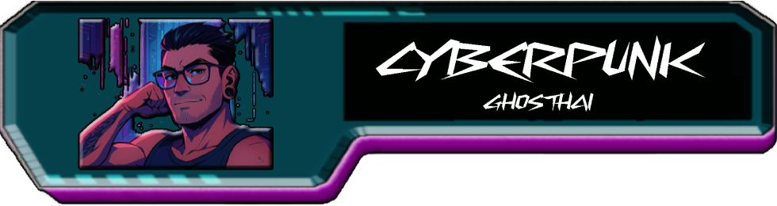
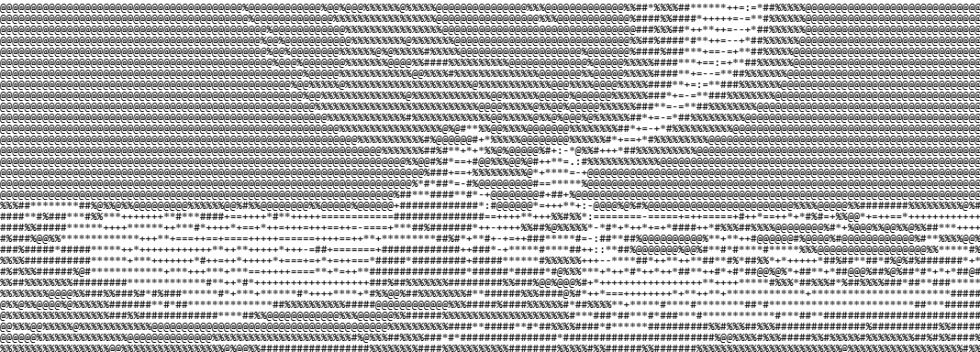
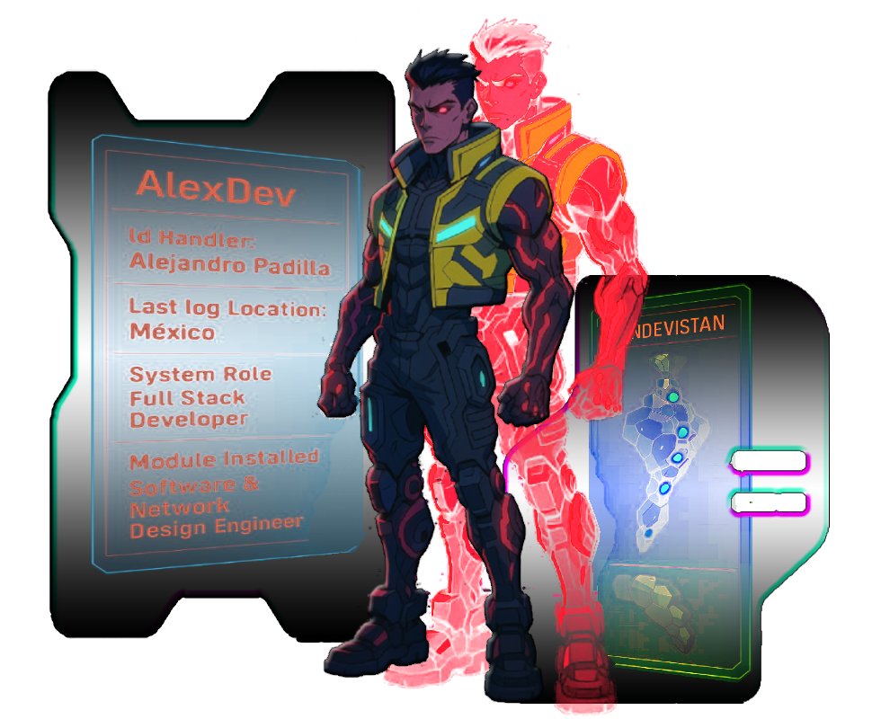
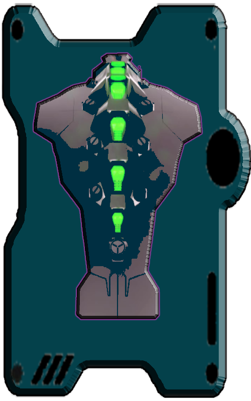

 <!-- Home Header -->
<div align="center">
  <table width="100%">
    <tr>
      <td>
        
      </td>
    </tr>
    <tr>
      <td>
        <div align="center">
<!-- Welcome Banner -->
         <h1>AlexDevPASo lution & CiberPunk EdgeRunners Mod</h2>
       </div>
      </td>
    </tr>
    <tr>
      <td>
        
      </td>
    </tr>
  </table>
</div>
<div align="center">
  
  ```diff
  @   @       @@   @      SYSTEM BOOT SEQUENCE INITIATED          @@      @@      @
  @     @@        @@       NEURAL INTERFACE: ESTABLISHED           @@        @@
  @@          @@     @    CYBERDECK STATUS: OPERATIONAL         @@          @@      @@
  ```

[](https://git.io/typing-svg)

</div>
<details>
<!-- About me Section -->
<summary>🟢 SYSTEM BOOTING...</summary>

## System Status

```diff
+ CONNECTION_STATUS: ACTIVE
+ PING: 23ms
+ ENCRYPTION: ENABLED
```
  
<div align="center">
  <table width="100%">
    <td>
      
    </td>
  </table>
</div>
</details>
<details>
<!-- Skills Section -->
<summary>🟢 EDGERUNNER LOADOUT...</summary>

##  Cyberware Modules (Skills)

<div align="center">
  <table>
    <tr>
      <th><br>Windows<br></th>
          <br>Apple<br>  
          <br>Ubuntu<br>
          <br>Android
      </th>
      <th>
        
      </th>
      <th>
        
      </th>
    </tr>
  </table>
</div>
    
    <td align="center"><br>Android</td>
    <td align="center"><br>AndroidStudio</td>
    <td align="center"><br>VSCode</td>
    <td align="center"><br>Git</td>
    <td align="center"><br>GitHub</td>
    <td align="center"><br>MySQL</td>
    <td align="center"><br>Powershell</td>
    <td align="center"><br>Bash</td>
      <td align="center"><br>Jira Software</td>
      <td align="center"><br>AutoDesk</td>
      <td align="center"><br>Markdown</td>
      <td align="center"><br>JavaScript</td>
      <td align="center"><br>Python</td>
      <td align="center"><br>React</td>
    </tr>
  </table> 
</div>
</details>
<details>
<!-- Projects Section -->
<summary>🟢 CYBER HEIST RECORDS...</summary>

## FEATURED OPERATIONS
  
<div>
</div>
</details>


